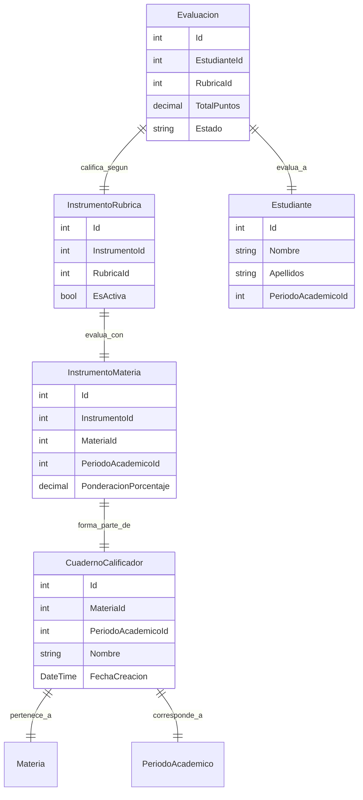

# Análisis: Cuaderno Calificador por Materia

## 📋 Requerimiento

Crear un **Cuaderno Calificador por Materia** que muestre:
- **Encabezado**: Período académico y materia
- **Tabla de calificaciones**: Estudiantes vs Rúbricas con notas
- **Ponderación**: Cada rúbrica tiene un peso específico que suma 100%
- **Total ponderado**: Calificación final por estudiante

## 🎯 Ejemplo Visual del Requerimiento

```
CUADERNO CALIFICADOR
━━━━━━━━━━━━━━━━━━━━━━━━━━━━━━━━━━━━━━━━━━━━━━━━━━━━━━━━

Período Académico: 2025 - C2
Materia: Inglés Técnico I

┌────────────────────────────────────────────────────────────────────────────┐
│                            TABLA DE CALIFICACIONES                        │
├─────────────────┬─────────────┬─────────────┬─────────────┬───────────────┤
│ ESTUDIANTE      │ TAREA 1     │ TAREA 2     │ PROYECTO 1  │ TOTAL         │
│                 │ (30%)       │ (30%)       │ (40%)       │ PONDERADO     │
├─────────────────┼─────────────┼─────────────┼─────────────┼───────────────┤
│ Juan Pérez      │    8.5      │    9.0      │    7.8      │     8.37      │
│ María González  │    9.2      │    8.8      │    9.5      │     9.19      │
│ Carlos Ruiz     │    7.0      │    8.2      │    8.9      │     8.17      │
│ Ana Martínez    │    8.8      │    7.5      │    9.2      │     8.59      │
└─────────────────┴─────────────┴─────────────┴─────────────┴───────────────┘

Fórmula: Total = (Tarea1 × 0.30) + (Tarea2 × 0.30) + (Proyecto1 × 0.40)
```

## 🏗️ Arquitectura de Datos

### **Entidades Involucradas**



## 📊 Modelos de Datos Requeridos

### **1. CuadernoCalificador.cs**
```csharp
public class CuadernoCalificador
{
    public int Id { get; set; }
    
    [Required]
    [Display(Name = "Materia")]
    public int MateriaId { get; set; }
    
    [Required]
    [Display(Name = "Período Académico")]
    public int PeriodoAcademicoId { get; set; }
    
    [Required]
    [StringLength(200)]
    [Display(Name = "Nombre del Cuaderno")]
    public string Nombre { get; set; } = string.Empty;
    
    [Display(Name = "Fecha de Creación")]
    public DateTime FechaCreacion { get; set; } = DateTime.Now;
    
    [Display(Name = "Estado")]
    public string Estado { get; set; } = "ACTIVO"; // ACTIVO, CERRADO, FINALIZADO
    
    [Display(Name = "Fecha de Cierre")]
    public DateTime? FechaCierre { get; set; }
    
    // Navigation Properties
    public virtual Materia Materia { get; set; } = null!;
    public virtual PeriodoAcademico PeriodoAcademico { get; set; } = null!;
    public virtual ICollection<CuadernoInstrumento> CuadernoInstrumentos { get; set; } = new List<CuadernoInstrumento>();
}
```

### **2. CuadernoInstrumento.cs**
```csharp
public class CuadernoInstrumento
{
    public int Id { get; set; }
    
    [Required]
    public int CuadernoCalificadorId { get; set; }
    
    [Required]
    public int InstrumentoMateriaId { get; set; }
    
    [Required]
    [Range(0.01, 100.00)]
    [Display(Name = "Ponderación (%)")]
    public decimal PonderacionPorcentaje { get; set; }
    
    [Display(Name = "Orden")]
    public int Orden { get; set; }
    
    [Display(Name = "Es Obligatorio")]
    public bool EsObligatorio { get; set; } = true;
    
    // Navigation Properties
    public virtual CuadernoCalificador CuadernoCalificador { get; set; } = null!;
    public virtual InstrumentoMateria InstrumentoMateria { get; set; } = null!;
}
```

### **3. CalificacionEstudiante.cs (Vista/ViewModel)**
```csharp
public class CalificacionEstudiante
{
    public int EstudianteId { get; set; }
    public string NombreCompleto { get; set; } = string.Empty;
    public string NumeroId { get; set; } = string.Empty;
    public Dictionary<int, decimal?> CalificacionesPorInstrumento { get; set; } = new();
    public decimal? TotalPonderado { get; set; }
    public string Estado { get; set; } = "PENDIENTE"; // PENDIENTE, COMPLETO, PARCIAL
}
```

## 🎨 ViewModels para la Vista

### **CuadernoCalificadorViewModel.cs**
```csharp
public class CuadernoCalificadorViewModel
{
    // Información del encabezado
    public int CuadernoId { get; set; }
    public string NombreCuaderno { get; set; } = string.Empty;
    public string NombreMateria { get; set; } = string.Empty;
    public string NombrePeriodoAcademico { get; set; } = string.Empty;
    public DateTime FechaCreacion { get; set; }
    public string Estado { get; set; } = string.Empty;
    
    // Información de instrumentos y ponderaciones
    public List<InstrumentoCalificacionInfo> Instrumentos { get; set; } = new();
    
    // Calificaciones de estudiantes
    public List<CalificacionEstudiante> CalificacionesEstudiantes { get; set; } = new();
    
    // Estadísticas
    public EstadisticasCuaderno Estadisticas { get; set; } = new();
    
    // Validaciones
    public bool PonderacionesValidas => Instrumentos.Sum(i => i.PonderacionPorcentaje) == 100m;
    public bool TieneCalificacionesCompletas => CalificacionesEstudiantes.All(c => c.Estado == "COMPLETO");
}

public class InstrumentoCalificacionInfo
{
    public int InstrumentoMateriaId { get; set; }
    public string NombreInstrumento { get; set; } = string.Empty;
    public string NombreRubrica { get; set; } = string.Empty;
    public decimal PonderacionPorcentaje { get; set; }
    public int Orden { get; set; }
    public bool EsObligatorio { get; set; }
    public int TotalEvaluaciones { get; set; }
    public int EvaluacionesCompletas { get; set; }
}

public class EstadisticasCuaderno
{
    public int TotalEstudiantes { get; set; }
    public int EstudiantesEvaluados { get; set; }
    public int EstudiantesPendientes { get; set; }
    public decimal PromedioGeneral { get; set; }
    public decimal NotaMaxima { get; set; }
    public decimal NotaMinima { get; set; }
    public Dictionary<string, int> DistribucionNotas { get; set; } = new();
}
```

## 🎮 Controller: CuadernoCalificadorController.cs

### **Métodos Principales**
```csharp
[Authorize]
public class CuadernoCalificadorController : Controller
{
    private readonly RubricasDbContext _context;
    private readonly ICuadernoCalificadorService _cuadernoService;

    // GET: Lista de cuadernos por materia y período
    public async Task<IActionResult> Index(int? materiaId, int? periodoAcademicoId)
    
    // GET: Ver cuaderno específico con tabla de calificaciones
    public async Task<IActionResult> Ver(int id)
    
    // GET: Crear nuevo cuaderno
    public async Task<IActionResult> Crear()
    
    // POST: Crear nuevo cuaderno
    [HttpPost]
    public async Task<IActionResult> Crear(CrearCuadernoViewModel model)
    
    // GET: Configurar instrumentos y ponderaciones
    public async Task<IActionResult> ConfigurarInstrumentos(int id)
    
    // POST: Guardar configuración de instrumentos
    [HttpPost]
    public async Task<IActionResult> ConfigurarInstrumentos(ConfigurarInstrumentosViewModel model)
    
    // POST: Actualizar ponderaciones vía AJAX
    [HttpPost]
    public async Task<IActionResult> ActualizarPonderaciones([FromBody] ActualizarPonderacionesRequest request)
    
    // GET: Exportar a Excel
    public async Task<IActionResult> ExportarExcel(int id)
    
    // GET: Generar reporte PDF
    public async Task<IActionResult> GenerarReportePDF(int id)
    
    // POST: Cerrar cuaderno (no más modificaciones)
    [HttpPost]
    public async Task<IActionResult> CerrarCuaderno(int id)
}
```

## 🔧 Servicios Requeridos

### **ICuadernoCalificadorService.cs**
```csharp
public interface ICuadernoCalificadorService
{
    Task<CuadernoCalificadorViewModel> ObtenerCuadernoAsync(int cuadernoId);
    Task<List<CalificacionEstudiante>> ObtenerCalificacionesEstudiantesAsync(int cuadernoId);
    Task<bool> ValidarPonderacionesAsync(int cuadernoId);
    Task<decimal> CalcularNotaPonderadaEstudianteAsync(int estudianteId, int cuadernoId);
    Task<EstadisticasCuaderno> GenerarEstadisticasAsync(int cuadernoId);
    Task<bool> CrearCuadernoAsync(CrearCuadernoViewModel model);
    Task<bool> ActualizarPonderacionesAsync(int cuadernoId, List<PonderacionInstrumento> ponderaciones);
    Task<byte[]> ExportarExcelAsync(int cuadernoId);
    Task<byte[]> GenerarReportePDFAsync(int cuadernoId);
}
```

## 📱 Vistas Requeridas

### **1. Views/CuadernoCalificador/Index.cshtml**
```html
@model List<CuadernoCalificador>

<div class="container-fluid">
    <div class="row mb-3">
        <div class="col">
            <h2><i class="fas fa-book"></i> Cuadernos Calificadores</h2>
        </div>
        <div class="col-auto">
            <a href="@Url.Action("Crear")" class="btn btn-primary">
                <i class="fas fa-plus"></i> Nuevo Cuaderno
            </a>
        </div>
    </div>
    
    <!-- Filtros -->
    <div class="card mb-3">
        <div class="card-body">
            <form method="get" class="row g-3">
                <div class="col-md-4">
                    <label class="form-label">Materia</label>
                    <select name="materiaId" class="form-select">
                        <!-- Opciones de materias -->
                    </select>
                </div>
                <div class="col-md-4">
                    <label class="form-label">Período Académico</label>
                    <select name="periodoAcademicoId" class="form-select">
                        <!-- Opciones de períodos -->
                    </select>
                </div>
                <div class="col-md-4 d-flex align-items-end">
                    <button type="submit" class="btn btn-outline-primary">
                        <i class="fas fa-search"></i> Filtrar
                    </button>
                </div>
            </form>
        </div>
    </div>
    
    <!-- Lista de cuadernos -->
    <div class="row">
        @foreach(var cuaderno in Model)
        {
            <div class="col-md-6 col-lg-4 mb-3">
                <div class="card">
                    <div class="card-header d-flex justify-content-between">
                        <h6 class="mb-0">@cuaderno.Nombre</h6>
                        <span class="badge bg-@(cuaderno.Estado == "ACTIVO" ? "success" : "secondary")">
                            @cuaderno.Estado
                        </span>
                    </div>
                    <div class="card-body">
                        <p class="text-muted mb-1">
                            <i class="fas fa-book-open"></i> @cuaderno.Materia.Nombre
                        </p>
                        <p class="text-muted mb-1">
                            <i class="fas fa-calendar"></i> @cuaderno.PeriodoAcademico.NombreCompleto
                        </p>
                        <p class="text-muted">
                            <i class="fas fa-clock"></i> @cuaderno.FechaCreacion.ToString("dd/MM/yyyy")
                        </p>
                    </div>
                    <div class="card-footer">
                        <a href="@Url.Action("Ver", new { id = cuaderno.Id })" 
                           class="btn btn-sm btn-primary">
                            <i class="fas fa-eye"></i> Ver Calificaciones
                        </a>
                        <a href="@Url.Action("ConfigurarInstrumentos", new { id = cuaderno.Id })" 
                           class="btn btn-sm btn-outline-secondary">
                            <i class="fas fa-cog"></i> Configurar
                        </a>
                    </div>
                </div>
            </div>
        }
    </div>
</div>
```

### **2. Views/CuadernoCalificador/Ver.cshtml**
```html
@model CuadernoCalificadorViewModel

<div class="container-fluid">
    <!-- Encabezado del cuaderno -->
    <div class="card mb-4">
        <div class="card-header bg-primary text-white">
            <div class="row align-items-center">
                <div class="col">
                    <h4 class="mb-0">
                        <i class="fas fa-book"></i> @Model.NombreCuaderno
                    </h4>
                </div>
                <div class="col-auto">
                    <div class="dropdown">
                        <button class="btn btn-light dropdown-toggle" type="button" data-bs-toggle="dropdown">
                            <i class="fas fa-download"></i> Exportar
                        </button>
                        <ul class="dropdown-menu">
                            <li>
                                <a class="dropdown-item" href="@Url.Action("ExportarExcel", new { id = Model.CuadernoId })">
                                    <i class="fas fa-file-excel"></i> Excel
                                </a>
                            </li>
                            <li>
                                <a class="dropdown-item" href="@Url.Action("GenerarReportePDF", new { id = Model.CuadernoId })">
                                    <i class="fas fa-file-pdf"></i> PDF
                                </a>
                            </li>
                        </ul>
                    </div>
                </div>
            </div>
        </div>
        <div class="card-body">
            <div class="row">
                <div class="col-md-6">
                    <p class="mb-1">
                        <strong><i class="fas fa-book-open"></i> Materia:</strong> 
                        @Model.NombreMateria
                    </p>
                    <p class="mb-1">
                        <strong><i class="fas fa-calendar"></i> Período Académico:</strong> 
                        @Model.NombrePeriodoAcademico
                    </p>
                </div>
                <div class="col-md-6">
                    <p class="mb-1">
                        <strong><i class="fas fa-clock"></i> Fecha de Creación:</strong> 
                        @Model.FechaCreacion.ToString("dd/MM/yyyy")
                    </p>
                    <p class="mb-1">
                        <strong><i class="fas fa-info-circle"></i> Estado:</strong> 
                        <span class="badge bg-@(Model.Estado == "ACTIVO" ? "success" : "secondary")">
                            @Model.Estado
                        </span>
                    </p>
                </div>
            </div>
        </div>
    </div>

    <!-- Validación de ponderaciones -->
    @if (!Model.PonderacionesValidas)
    {
        <div class="alert alert-warning" role="alert">
            <i class="fas fa-exclamation-triangle"></i>
            <strong>Atención:</strong> La suma de las ponderaciones debe ser exactamente 100%. 
            Suma actual: @Model.Instrumentos.Sum(i => i.PonderacionPorcentaje)%
            <a href="@Url.Action("ConfigurarInstrumentos", new { id = Model.CuadernoId })" class="alert-link">
                Configurar Instrumentos
            </a>
        </div>
    }

    <!-- Tabla de calificaciones -->
    <div class="card">
        <div class="card-header">
            <h5 class="mb-0">
                <i class="fas fa-table"></i> Tabla de Calificaciones
            </h5>
        </div>
        <div class="card-body p-0">
            <div class="table-responsive">
                <table class="table table-striped table-hover mb-0">
                    <thead class="table-dark">
                        <tr>
                            <th style="min-width: 200px;">
                                <i class="fas fa-user"></i> Estudiante
                            </th>
                            @foreach(var instrumento in Model.Instrumentos.OrderBy(i => i.Orden))
                            {
                                <th class="text-center" style="min-width: 120px;">
                                    <div>@instrumento.NombreInstrumento</div>
                                    <small class="text-light">(@instrumento.PonderacionPorcentaje%)</small>
                                </th>
                            }
                            <th class="text-center bg-warning text-dark" style="min-width: 120px;">
                                <i class="fas fa-calculator"></i> TOTAL PONDERADO
                            </th>
                        </tr>
                    </thead>
                    <tbody>
                        @foreach(var estudiante in Model.CalificacionesEstudiantes.OrderBy(e => e.NombreCompleto))
                        {
                            <tr>
                                <td>
                                    <div>
                                        <strong>@estudiante.NombreCompleto</strong>
                                    </div>
                                    <small class="text-muted">ID: @estudiante.NumeroId</small>
                                </td>
                                @foreach(var instrumento in Model.Instrumentos.OrderBy(i => i.Orden))
                                {
                                    <td class="text-center">
                                        @if(estudiante.CalificacionesPorInstrumento.ContainsKey(instrumento.InstrumentoMateriaId))
                                        {
                                            var nota = estudiante.CalificacionesPorInstrumento[instrumento.InstrumentoMateriaId];
                                            if(nota.HasValue)
                                            {
                                                <span class="badge bg-@(ObtenerColorNota(nota.Value)) fs-6">
                                                    @nota.Value.ToString("0.00")
                                                </span>
                                            }
                                            else
                                            {
                                                <span class="text-muted">-</span>
                                            }
                                        }
                                        else
                                        {
                                            <span class="text-muted">-</span>
                                        }
                                    </td>
                                }
                                <td class="text-center bg-light">
                                    @if(estudiante.TotalPonderado.HasValue)
                                    {
                                        <strong class="text-@(ObtenerColorNota(estudiante.TotalPonderado.Value))">
                                            @estudiante.TotalPonderado.Value.ToString("0.00")
                                        </strong>
                                    }
                                    else
                                    {
                                        <span class="text-muted">-</span>
                                    }
                                </td>
                            </tr>
                        }
                    </tbody>
                </table>
            </div>
        </div>
    </div>

    <!-- Estadísticas -->
    <div class="row mt-4">
        <div class="col-md-3">
            <div class="card text-center">
                <div class="card-body">
                    <h4 class="text-primary">@Model.Estadisticas.TotalEstudiantes</h4>
                    <p class="text-muted mb-0">Total Estudiantes</p>
                </div>
            </div>
        </div>
        <div class="col-md-3">
            <div class="card text-center">
                <div class="card-body">
                    <h4 class="text-success">@Model.Estadisticas.EstudiantesEvaluados</h4>
                    <p class="text-muted mb-0">Evaluados</p>
                </div>
            </div>
        </div>
        <div class="col-md-3">
            <div class="card text-center">
                <div class="card-body">
                    <h4 class="text-warning">@Model.Estadisticas.EstudiantesPendientes</h4>
                    <p class="text-muted mb-0">Pendientes</p>
                </div>
            </div>
        </div>
        <div class="col-md-3">
            <div class="card text-center">
                <div class="card-body">
                    <h4 class="text-info">@Model.Estadisticas.PromedioGeneral.ToString("0.00")</h4>
                    <p class="text-muted mb-0">Promedio General</p>
                </div>
            </div>
        </div>
    </div>
</div>

@functions {
    private string ObtenerColorNota(decimal nota)
    {
        if (nota >= 9.0m) return "success";
        if (nota >= 8.0m) return "info";
        if (nota >= 7.0m) return "warning";
        return "danger";
    }
}
```

## 📈 Funcionalidades Avanzadas

### **1. Cálculo Automático de Ponderaciones**
```javascript
// wwwroot/js/cuaderno-calificador.js
function actualizarPonderaciones() {
    const inputs = document.querySelectorAll('.ponderacion-input');
    let total = 0;
    
    inputs.forEach(input => {
        total += parseFloat(input.value) || 0;
    });
    
    const indicadorTotal = document.getElementById('total-ponderacion');
    indicadorTotal.textContent = total.toFixed(2) + '%';
    
    if (total === 100) {
        indicadorTotal.className = 'badge bg-success';
    } else {
        indicadorTotal.className = 'badge bg-danger';
    }
}

function calcularNotaPonderada(estudianteId) {
    const fila = document.querySelector(`tr[data-estudiante="${estudianteId}"]`);
    const notas = fila.querySelectorAll('.nota-input');
    const ponderaciones = document.querySelectorAll('.ponderacion-input');
    
    let totalPonderado = 0;
    let sumaPonderaciones = 0;
    
    notas.forEach((nota, index) => {
        const valorNota = parseFloat(nota.value) || 0;
        const ponderacion = parseFloat(ponderaciones[index].value) || 0;
        
        if (valorNota > 0) {
            totalPonderado += (valorNota * ponderacion / 100);
            sumaPonderaciones += ponderacion;
        }
    });
    
    const celdaTotal = fila.querySelector('.total-ponderado');
    if (sumaPonderaciones > 0) {
        celdaTotal.textContent = totalPonderado.toFixed(2);
    } else {
        celdaTotal.textContent = '-';
    }
}
```

### **2. Exportación a Excel**
```csharp
public async Task<byte[]> ExportarExcelAsync(int cuadernoId)
{
    var cuaderno = await ObtenerCuadernoAsync(cuadernoId);
    
    using var workbook = new XLWorkbook();
    var worksheet = workbook.Worksheets.Add("Calificaciones");
    
    // Encabezado
    worksheet.Cell(1, 1).Value = "CUADERNO CALIFICADOR";
    worksheet.Cell(2, 1).Value = $"Materia: {cuaderno.NombreMateria}";
    worksheet.Cell(3, 1).Value = $"Período: {cuaderno.NombrePeriodoAcademico}";
    
    // Headers de tabla
    int fila = 5;
    int columna = 1;
    
    worksheet.Cell(fila, columna++).Value = "Estudiante";
    
    foreach (var instrumento in cuaderno.Instrumentos.OrderBy(i => i.Orden))
    {
        worksheet.Cell(fila, columna).Value = $"{instrumento.NombreInstrumento} ({instrumento.PonderacionPorcentaje}%)";
        columna++;
    }
    
    worksheet.Cell(fila, columna).Value = "TOTAL PONDERADO";
    
    // Datos
    fila++;
    foreach (var estudiante in cuaderno.CalificacionesEstudiantes.OrderBy(e => e.NombreCompleto))
    {
        columna = 1;
        worksheet.Cell(fila, columna++).Value = estudiante.NombreCompleto;
        
        foreach (var instrumento in cuaderno.Instrumentos.OrderBy(i => i.Orden))
        {
            var nota = estudiante.CalificacionesPorInstrumento.ContainsKey(instrumento.InstrumentoMateriaId)
                ? estudiante.CalificacionesPorInstrumento[instrumento.InstrumentoMateriaId]
                : null;
            
            worksheet.Cell(fila, columna++).Value = nota?.ToString("0.00") ?? "-";
        }
        
        worksheet.Cell(fila, columna).Value = estudiante.TotalPonderado?.ToString("0.00") ?? "-";
        fila++;
    }
    
    // Formateo
    worksheet.RangeUsed().SetAutoFilter();
    worksheet.Columns().AdjustToContents();
    
    using var stream = new MemoryStream();
    workbook.SaveAs(stream);
    return stream.ToArray();
}
```

## 🔧 Configuración en Program.cs

```csharp
// Program.cs
builder.Services.AddScoped<ICuadernoCalificadorService, CuadernoCalificadorService>();

// Configurar ClosedXML para exportar Excel
builder.Services.AddSingleton<IExcelService, ExcelService>();

// Configurar generación de PDF
builder.Services.AddSingleton<IPdfService, PdfService>();
```

## 📋 Plan de Implementación

### **Fase 1: Modelos y Base de Datos**
1. ✅ Crear entidades `CuadernoCalificador` y `CuadernoInstrumento`
2. ✅ Configurar relaciones en `DbContext`
3. ✅ Generar y ejecutar migración
4. ✅ Crear datos de prueba

### **Fase 2: Servicios y Lógica de Negocio**
1. ✅ Implementar `ICuadernoCalificadorService`
2. ✅ Crear métodos para cálculo de ponderaciones
3. ✅ Implementar validaciones de integridad
4. ✅ Crear servicios de exportación

### **Fase 3: Controllers y Vistas**
1. ✅ Crear `CuadernoCalificadorController`
2. ✅ Implementar vista principal con tabla
3. ✅ Crear formularios de configuración
4. ✅ Añadir funcionalidad AJAX

### **Fase 4: Funcionalidades Avanzadas**
1. ✅ Exportación a Excel y PDF
2. ✅ Estadísticas y reportes
3. ✅ Validaciones en tiempo real
4. ✅ Optimización de rendimiento

## ✅ Criterios de Aceptación

- [ ] **Visualización**: Tabla clara con estudiantes vs instrumentos/rúbricas
- [ ] **Ponderaciones**: Suma exacta del 100% para todos los instrumentos
- [ ] **Cálculo automático**: Total ponderado se calcula automáticamente
- [ ] **Configuración**: Permite agregar/quitar instrumentos y modificar ponderaciones
- [ ] **Exportación**: Genera Excel y PDF con formato profesional
- [ ] **Validaciones**: Impide configuraciones inválidas
- [ ] **Estadísticas**: Muestra promedios, máximos, mínimos
- [ ] **Performance**: Carga rápida incluso con muchos estudiantes
- [ ] **Responsive**: Funciona correctamente en dispositivos móviles

---

**Documento de Análisis - Cuaderno Calificador por Materia**  
**Fecha**: 18 de agosto de 2025  
**Versión**: 1.0  
**Estado**: Listo para Implementación