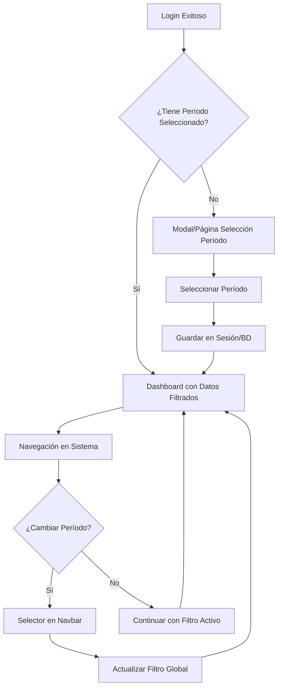

# Implementación de Filtro Global por Período Académico

## 📋 Requerimiento

Implementar un **filtro global de período académico** que permita a los usuarios seleccionar un período específico al iniciar sesión y que este filtro se aplique automáticamente a todos los datos mostrados en el sistema durante toda la sesión.

## 🎯 Objetivos

- **Contextualización**: Los usuarios trabajen siempre en el contexto de un período académico específico
- **Consistencia**: Todos los datos mostrados correspondan al período seleccionado
- **Eficiencia**: Consultas más rápidas al filtrar por período desde el inicio
- **UX Mejorada**: Interfaz más limpia y enfocada en el período de trabajo actual

## 🏗️ Arquitectura Propuesta

### 1. **Servicio de Período Académico**
```csharp
public interface IPeriodoAcademicoService
{
    Task<PeriodoAcademico> GetPeriodoActivoAsync(string userId);
    Task SetPeriodoActivoAsync(string userId, int periodoId);
    Task<IEnumerable<PeriodoAcademico>> GetPeriodosDisponiblesAsync();
    Task<PeriodoAcademico> GetPeriodoDefaultAsync();
    bool TienePeriodoSeleccionado(string userId);
}
```

### 2. **Base Controller con Filtro Automático**
```csharp
public abstract class BaseController : Controller
{
    protected readonly IPeriodoAcademicoService _periodoService;
    protected PeriodoAcademico PeriodoActivo { get; private set; }

    public override async Task OnActionExecutionAsync(ActionExecutingContext context, ActionExecutionDelegate next)
    {
        // Obtener período activo del usuario
        var userId = User.Identity.Name;
        PeriodoActivo = await _periodoService.GetPeriodoActivoAsync(userId);
        
        ViewBag.PeriodoActivo = PeriodoActivo;
        ViewBag.PeriodosDisponibles = await _periodoService.GetPeriodosDisponiblesAsync();
        
        await next();
    }
}
```

### 3. **Middleware de Período Académico**
```csharp
public class PeriodoAcademicoMiddleware
{
    public async Task InvokeAsync(HttpContext context, RequestDelegate next)
    {
        if (context.User.Identity.IsAuthenticated)
        {
            var userId = context.User.Identity.Name;
            var periodoService = context.RequestServices.GetService<IPeriodoAcademicoService>();
            
            // Verificar si el usuario tiene período seleccionado
            if (!periodoService.TienePeriodoSeleccionado(userId))
            {
                // Redirigir a selección de período si es necesario
                if (!context.Request.Path.StartsWithSegments("/PeriodoAcademico/Seleccionar"))
                {
                    context.Response.Redirect("/PeriodoAcademico/Seleccionar");
                    return;
                }
            }
        }
        
        await next(context);
    }
}
```

## 📍 Ubicaciones del Selector

### **Opción 1: Navbar (Recomendada)**
- **Ubicación**: Header superior, lado derecho
- **Ventajas**: Siempre visible, fácil acceso
- **Comportamiento**: Dropdown con períodos disponibles

### **Opción 2: Dashboard Principal**
- **Ubicación**: Prominente en la página de inicio
- **Ventajas**: Primera interacción al ingresar
- **Comportamiento**: Card destacada con selección

### **Opción 3: Modal de Bienvenida**
- **Ubicación**: Modal al primer login sin período
- **Ventajas**: Fuerza la selección inicial
- **Comportamiento**: Modal obligatorio en primera sesión

## 🔄 Flujo de Usuario



## 📊 Pantallas Afectadas

### **Principales**
- ✅ **Dashboard/Home**: Resumen del período seleccionado
- ✅ **Evaluaciones**: Solo evaluaciones del período activo
- ✅ **Rúbricas**: Rúbricas aplicables al período
- ✅ **InstrumentoMaterias**: Relaciones del período específico
- ✅ **Reportes**: Datos del período seleccionado
- ✅ **Estudiantes**: Matriculados en el período
- ✅ **Materias**: Activas en el período

### **Filtros Automáticos**
```csharp
// Ejemplo en InstrumentoMateriasController
public async Task<IActionResult> Index()
{
    var instrumentoMaterias = await _context.InstrumentoMaterias
        .Include(im => im.InstrumentoEvaluacion)
        .Include(im => im.Materia)
        .Include(im => im.PeriodoAcademico)
        .Where(im => im.PeriodoAcademicoId == PeriodoActivo.Id) // Filtro automático
        .ToListAsync();
    
    return View(instrumentoMaterias);
}
```

## 🛠️ Implementación Técnica

### **1. Almacenamiento del Filtro**
```csharp
// Múltiples niveles de persistencia
public class PeriodoAcademicoService : IPeriodoAcademicoService
{
    // 1. Session (inmediato)
    private const string SESSION_KEY = "PeriodoAcademicoActivo";
    
    // 2. Database (persistente)
    // Agregar campo PeriodoAcademicoPreferido a AspNetUsers
    
    // 3. Cookie (respaldo)
    private const string COOKIE_KEY = "UltimoPeriodoAcademico";
}
```

### **2. Componente de Vista Reutilizable**
```html
<!-- Views/Shared/Components/PeriodoAcademicoSelector/Default.cshtml -->
<div class="periodo-academico-selector">
    <div class="dropdown">
        <button class="btn btn-outline-primary dropdown-toggle" type="button" data-bs-toggle="dropdown">
            <i class="fas fa-calendar"></i>
            @Model.PeriodoActivo.NombreCompleto
        </button>
        <ul class="dropdown-menu">
            @foreach(var periodo in Model.PeriodosDisponibles)
            {
                <li>
                    <a class="dropdown-item" href="#" 
                       onclick="cambiarPeriodo(@periodo.Id)">
                        @periodo.NombreCompleto
                        @if(periodo.Id == Model.PeriodoActivo.Id)
                        {
                            <i class="fas fa-check text-success ms-2"></i>
                        }
                    </a>
                </li>
            }
        </ul>
    </div>
</div>
```

### **3. JavaScript para Cambio Dinámico**
```javascript
function cambiarPeriodo(periodoId) {
    fetch('/PeriodoAcademico/CambiarPeriodo', {
        method: 'POST',
        headers: {
            'Content-Type': 'application/json',
        },
        body: JSON.stringify({ periodoId: periodoId })
    })
    .then(response => response.json())
    .then(data => {
        if(data.success) {
            // Recargar página para aplicar nuevo filtro
            window.location.reload();
        }
    });
}
```

## 📁 Archivos a Crear/Modificar

### **Nuevos Archivos**
- `Services/IPeriodoAcademicoService.cs`
- `Services/PeriodoAcademicoService.cs`
- `Controllers/PeriodoAcademicoController.cs`
- `ViewModels/PeriodoAcademicoViewModel.cs`
- `Views/PeriodoAcademico/Seleccionar.cshtml`
- `Views/Shared/Components/PeriodoAcademicoSelector/`
- `Middleware/PeriodoAcademicoMiddleware.cs`

### **Archivos a Modificar**
- `Controllers/BaseController.cs` (crear si no existe)
- `Views/Shared/_Layout.cshtml` (agregar selector)
- `Program.cs` (registrar servicios y middleware)
- `Controllers/*.cs` (heredar de BaseController)
- `wwwroot/js/site.js` (funciones de cambio de período)

## 🎨 Diseño de UI

### **Indicator Visual en Navbar**
```html
<div class="navbar-period-indicator">
    <span class="badge bg-primary">
        <i class="fas fa-calendar-alt"></i>
        Período: @ViewBag.PeriodoActivo.NombreCompleto
    </span>
</div>
```

### **Dashboard con Contexto**
```html
<div class="dashboard-header">
    <h2>Dashboard - @ViewBag.PeriodoActivo.NombreCompleto</h2>
    <p class="text-muted">
        @ViewBag.PeriodoActivo.FechaInicio.ToString("dd/MM/yyyy") - 
        @ViewBag.PeriodoActivo.FechaFin.ToString("dd/MM/yyyy")
    </p>
</div>
```

## ⚡ Consideraciones de Performance

### **Indexación de Base de Datos**
```sql
-- Crear índices para consultas rápidas por período
CREATE INDEX IX_InstrumentoMaterias_PeriodoAcademicoId 
ON InstrumentoMaterias(PeriodoAcademicoId);

CREATE INDEX IX_Evaluaciones_PeriodoAcademicoId 
ON Evaluaciones(PeriodoAcademicoId);
```

### **Caché de Períodos**
```csharp
// Cachear lista de períodos para evitar consultas repetidas
services.AddMemoryCache();
// En el servicio: cache períodos por 1 hora
```

## 🔒 Consideraciones de Seguridad

### **Permisos por Período**
```csharp
// Verificar que el usuario tenga acceso al período seleccionado
public async Task<bool> UsuarioPuedeAccederPeriodo(string userId, int periodoId)
{
    // Lógica según roles y permisos
    // Ej: Docentes solo ven períodos donde tienen materias asignadas
}
```

### **Validación de Datos**
- Verificar que el período existe y está activo
- Validar permisos del usuario para el período
- Sanitizar parámetros de entrada

## 🧪 Plan de Pruebas

### **Casos de Prueba**
1. **Login sin período**: Debe forzar selección
2. **Cambio de período**: Debe actualizar todos los datos
3. **Persistencia**: Período debe mantenerse entre sesiones
4. **Permisos**: Solo mostrar períodos autorizados
5. **Performance**: Consultas deben ser eficientes

### **Pruebas de Integración**
- Verificar filtro en todas las pantallas principales
- Confirmar funcionamiento del selector en navbar
- Validar persistencia en diferentes navegadores

## 📈 Métricas de Éxito

- **UX**: Reducción en confusión de usuarios sobre datos mostrados
- **Performance**: Mejora en tiempo de carga de pantallas
- **Adopción**: % de usuarios que utilizan el filtro activamente
- **Errores**: Reducción en errores de "datos no encontrados"

## 🚀 Fases de Implementación

### **Fase 1: Base**
1. Crear servicio de período académico
2. Implementar selector en navbar
3. Modificar controllers principales

### **Fase 2: Integración**
1. Aplicar filtro en todas las pantallas
2. Implementar persistencia en base de datos
3. Crear middleware de validación

### **Fase 3: Refinamiento**
1. Optimizar performance con índices
2. Mejorar UX con indicadores visuales
3. Agregar pruebas automáticas

## ✅ Criterios de Aceptación

- [ ] Usuario puede seleccionar período académico al iniciar sesión
- [ ] Período seleccionado persiste durante toda la sesión
- [ ] Todos los datos mostrados corresponden al período activo
- [ ] Usuario puede cambiar período fácilmente desde navbar
- [ ] Cambio de período actualiza automáticamente todos los datos
- [ ] Sistema maneja usuarios sin período asignado
- [ ] Performance no se ve afectada negativamente
- [ ] Funcionalidad es consistente en todo el sistema

---

**Autor**: Sistema de Rúbricas - Desarrollo  
**Fecha**: 18 de agosto de 2025  
**Versión**: 1.0  
**Estado**: Propuesta para Implementación