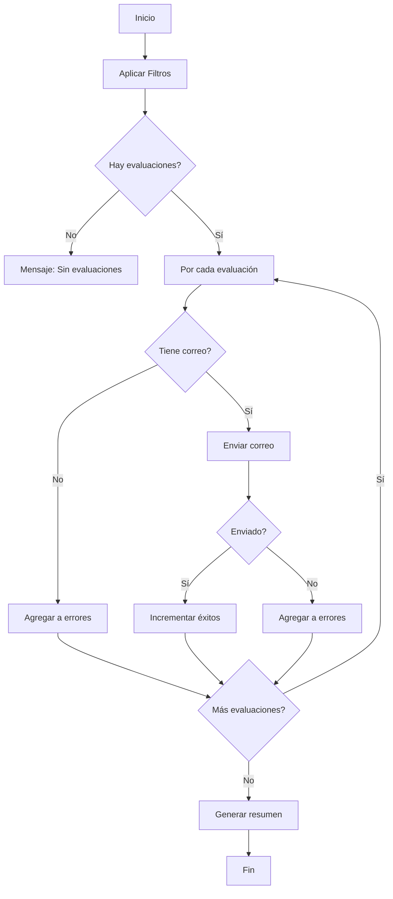

# 📧 Envío de Correos de Evaluaciones - Documentación Técnica

## 🎯 Descripción General

Sistema de notificación por correo electrónico para resultados de evaluaciones del Sistema de Rúbricas MEP. Permite enviar resultados individuales o masivos a estudiantes con plantillas HTML profesionales.

---

## 🔧 Configuración SMTP

### Ubicación: `appsettings.json`

```json
{
  "Email": {
    "SmtpServer": "smtp.gmail.com",
    "SmtpPort": "587",
    "From": "heiguicam@gmail.com",
    "FromName": "Sistema de Evaluaciones",
    "Password": "ldlh pzqx bbzu qbgo",
    "DisplayName": "Sistema de Evaluaciones"
  }
}
```

### ⚙️ Configuración para Gmail

Si usas Gmail, debes generar una **Contraseña de aplicación**:

1. Ir a: https://myaccount.google.com/security
2. Activar **Verificación en 2 pasos**
3. Ir a **Contraseñas de aplicaciones**
4. Generar una nueva contraseña para "Correo"
5. Usar esa contraseña en `Email:Password`

### 🔒 Configuración para Otros Proveedores

#### Office 365 / Outlook
```json
{
  "Email": {
    "SmtpServer": "smtp.office365.com",
    "SmtpPort": "587",
    "From": "tu-correo@educacion.go.cr",
    "Password": "tu-contraseña"
  }
}
```

#### Yahoo Mail
```json
{
  "Email": {
    "SmtpServer": "smtp.mail.yahoo.com",
    "SmtpPort": "587",
    "From": "tu-correo@yahoo.com",
    "Password": "tu-contraseña"
  }
}
```

---

## 📋 Métodos Implementados

### 1. `EnviarCorreoReal` (Privado)

**Ubicación:** `Controllers/EvaluacionesController.cs` - Línea ~927

**Propósito:** Envía un correo electrónico real usando el servicio `IEmailService`

```csharp
private async Task<bool> EnviarCorreoReal(Evaluacion evaluacion)
```

**Retorna:**
- `true`: Correo enviado exitosamente
- `false`: Error al enviar

**Características:**
- ✅ Usa `IEmailService.SendEmailAsync()`
- ✅ Genera contenido HTML profesional
- ✅ Logging detallado
- ✅ Manejo robusto de errores

---

### 2. `EnviarEvaluacion` (Endpoint AJAX)

**Ruta:** `POST /Evaluaciones/EnviarEvaluacion`

**Parámetros:**
```json
{
  "evaluacionId": 123
}
```

**Respuesta Exitosa:**
```json
{
  "success": true,
  "message": "Evaluacion enviada exitosamente a Juan Pérez (juan.perez@estudiante.cr)"
}
```

**Respuesta Error:**
```json
{
  "success": false,
  "message": "El estudiante Juan Pérez no tiene direccion de correo configurada"
}
```

---

### 3. `EnviarTodasEvaluaciones` (Endpoint AJAX)

**Ruta:** `POST /Evaluaciones/EnviarTodasEvaluaciones`

**Parámetros:**
```json
{
  "estudianteId": 10,    // Opcional
  "rubricaId": 5,        // Opcional
  "periodoId": 2         // Opcional
}
```

**Respuesta:**
```json
{
  "success": true,
  "message": "Proceso completado: 25 evaluaciones enviadas exitosamente, 3 errores",
  "detalles": {
    "totalEvaluaciones": 28,
    "enviadosExitosos": 25,
    "errores": [
      "Error enviando a María López: No tiene direccion de correo",
      "Error enviando a Pedro Ramírez: No se pudo enviar el correo",
      "Error enviando a Ana García: No tiene direccion de correo"
    ]
  }
}
```

**Filtros:**
- Solo envía evaluaciones con estado **"COMPLETADA"**
- Requiere que el estudiante tenga correo electrónico configurado
- Soporta filtrado por estudiante, rúbrica o período académico

---

### 4. `GenerarContenidoCorreo` (Privado)

**Ubicación:** `Controllers/EvaluacionesController.cs` - Línea ~957

**Propósito:** Genera HTML profesional con los resultados de la evaluación

**Contenido del Correo:**

```html
<!DOCTYPE html>
<html>
<head>
    <meta charset="UTF-8">
</head>
<body style="font-family: Arial, sans-serif; color: #333;">
    <h2 style="color: #004085;">Resultado de Evaluación</h2>
    <p><strong>Estimado/a [Nombre Estudiante],</strong></p>
    
    <div style="border: 1px solid #ced4da; padding: 20px;">
        <h3>Detalles de la Evaluación</h3>
        <ul>
            <li><strong>📋 Rúbrica:</strong> [Nombre Rúbrica]</li>
            <li><strong>📅 Fecha:</strong> [DD/MM/YYYY HH:mm]</li>
            <li><strong>🎯 Puntaje total:</strong> [XX.XX] puntos</li>
            <li><strong>📚 Período académico:</strong> [Nombre Período]</li>
        </ul>
    </div>
    
    <h4>Detalles por Ítem</h4>
    <table style="border-collapse: collapse; width: 100%;">
        <thead>
            <tr>
                <th>Ítem</th>
                <th>Nivel Alcanzado</th>
                <th>Puntos</th>
            </tr>
        </thead>
        <tbody>
            <!-- Detalles de cada ítem evaluado -->
        </tbody>
    </table>
    
    <div style="margin-top: 20px;">
        <h4>Observaciones</h4>
        <blockquote>[Observaciones del docente]</blockquote>
    </div>
    
    <p>Saludos cordiales,<br>
    <strong>Sistema de Evaluación por Rúbricas</strong></p>
</body>
</html>
```

**Características:**
- ✅ Diseño responsive
- ✅ Tabla con detalles de cada ítem evaluado
- ✅ Observaciones del docente (si existen)
- ✅ Información del período académico
- ✅ Formato profesional acorde al MEP

---

## 🚀 Uso desde la Interfaz Web

### Envío Individual

1. Ir a **Evaluaciones** → **Índice**
2. Localizar la evaluación deseada
3. Click en el botón **📧 Enviar Correo**
4. El sistema enviará el correo y mostrará notificación

### Envío Masivo

1. Ir a **Evaluaciones** → **Índice**
2. Aplicar filtros opcionales (estudiante, rúbrica, período)
3. Click en el botón **📧 Enviar Todos**
4. El sistema procesará todas las evaluaciones completadas
5. Mostrará resumen con éxitos y errores

---

## 🔍 Validaciones Implementadas

### Pre-envío
- ✅ Verifica que la evaluación exista
- ✅ Valida que el estudiante tenga correo configurado
- ✅ Verifica estado "COMPLETADA" (solo en envío masivo)
- ✅ Valida configuración SMTP en `appsettings.json`

### Durante el Envío
- ✅ Manejo de errores por estudiante (no detiene el proceso masivo)
- ✅ Logging detallado de cada operación
- ✅ Registro de éxitos y fallos

### Post-envío
- ✅ Notificación al usuario con resultado
- ✅ Detalles de errores en envío masivo
- ✅ Log persistente en archivos del sistema

---

## 📊 Logs y Monitoreo

### Ubicación de Logs

**Desarrollo:**
```
D:\Fuentes_gitHub\RubricasApp.Web\logs\
```

**Producción (Render.com):**
```
/app/logs/
```

### Tipos de Log

#### ✅ Envío Exitoso
```log
[INFO] ✅ Correo enviado exitosamente a: juan.perez@estudiante.cr
```

#### ⚠️ Advertencia
```log
[WARN] ⚠️ Falló el envío de correo a: maria.lopez@estudiante.cr
```

#### ❌ Error
```log
[ERROR] ❌ Error al enviar correo a pedro.ramirez@estudiante.cr
System.Net.Mail.SmtpException: The SMTP server requires a secure connection...
```

---

## 🛠️ Troubleshooting

### Error: "The SMTP server requires a secure connection"

**Solución:** Verificar que `SmtpPort` sea `587` y que Gmail tenga habilitada la verificación en 2 pasos.

---

### Error: "Authentication failed"

**Causas posibles:**
1. Contraseña incorrecta
2. Gmail: No se generó contraseña de aplicación
3. Cuenta bloqueada por seguridad

**Solución:**
- Usar contraseña de aplicación (Gmail)
- Verificar credenciales en `appsettings.json`
- Revisar logs de seguridad de la cuenta de correo

---

### Error: "No se pudo enviar el correo"

**Verificar:**
1. Conexión a internet
2. Firewall no bloquea puerto 587
3. Configuración SMTP correcta
4. Logs del sistema para detalles

---

### Estudiantes sin correo

**Solución:**
1. Ir a **Estudiantes** → **Editar**
2. Agregar dirección de correo en campo `DireccionCorreo`
3. Guardar cambios

---

## 🔐 Seguridad

### Buenas Prácticas Implementadas

✅ **Variables de Entorno (Producción):**
```bash
# En Render.com:
Email__Password=xxxx-xxxx-xxxx-xxxx
```

✅ **Contraseñas de Aplicación:**
- Nunca usar contraseña principal de Gmail
- Usar contraseñas generadas específicamente

✅ **SSL/TLS:**
- Puerto 587 con `EnableSsl = true`
- Conexión encriptada

✅ **Logging Seguro:**
- No se registran contraseñas en logs
- Solo se registran destinatarios y resultados

---

## 📈 Estadísticas de Uso

### Métricas Disponibles

El sistema registra:
- Total de correos enviados
- Tasa de éxito/fallo
- Estudiantes sin correo configurado
- Tiempo promedio de envío

### Consulta de Logs

```bash
# Ver últimos 50 envíos
tail -n 50 logs/rubricasapp-20250128.log | grep "Correo enviado"

# Contar éxitos del día
grep "✅ Correo enviado" logs/rubricasapp-20250128.log | wc -l

# Ver errores
grep "ERROR.*correo" logs/rubricasapp-20250128.log
```

---

## 🔄 Proceso de Envío Masivo



---

## 📝 Ejemplo de Uso Programático

```csharp
// Enviar evaluación individual
var evaluacion = await _context.Evaluaciones
    .Include(e => e.Estudiante)
    .Include(e => e.Rubrica)
    .Include(e => e.DetallesEvaluacion)
        .ThenInclude(d => d.ItemEvaluacion)
    .Include(e => e.DetallesEvaluacion)
        .ThenInclude(d => d.NivelCalificacion)
    .FirstOrDefaultAsync(e => e.IdEvaluacion == evaluacionId);

if (evaluacion != null && !string.IsNullOrEmpty(evaluacion.Estudiante.DireccionCorreo))
{
    var resultado = await EnviarCorreoReal(evaluacion);
    if (resultado)
    {
        Console.WriteLine("✅ Correo enviado exitosamente");
    }
}
```

---

## 🎓 Integración con Módulos MEP

El sistema de correos está integrado con:

- **✅ Evaluaciones por Rúbricas:** Notificación automática de resultados
- **✅ Períodos Académicos:** Filtrado por trimestre/semestre
- **✅ Estudiantes:** Validación de correos electrónicos
- **✅ Conducta:** (Futuro) Notificación de boletas

---

## 📞 Soporte

Para problemas con el envío de correos:

1. Verificar configuración SMTP
2. Revisar logs del sistema
3. Validar credenciales de correo
4. Contactar al administrador del sistema

---

**Última actualización:** 28 de enero de 2025  
**Versión:** 1.0.0  
**Responsable:** Sistema de Rúbricas MEP
